# Yappaflow Architecture Diagram

```mermaid
graph TD
    %% ─────────────────────────────────────────
    %% EXTERNAL SERVICES
    %% ─────────────────────────────────────────
    subgraph EXT["External Services"]
        META["Meta Graph API\n(Instagram + WhatsApp Business)"]
        TWILIO["Twilio\n(SMS / OTP)"]
    end

    %% ─────────────────────────────────────────
    %% EXPRESS SERVER
    %% ─────────────────────────────────────────
    subgraph SERVER["Express Server  :4000"]
        GQL["Apollo GraphQL\n/graphql\n─────────────────\nAuth · Projects\nSignals · Messages"]
        WEBHOOK["Webhook Handler\n/webhook"]
        SSE["SSE Service\n/events"]
        OAUTH["Instagram OAuth\n/auth/instagram/authorize"]
        JWT["JWT Issuer\n& Middleware"]
    end

    %% ─────────────────────────────────────────
    %% DATABASE
    %% ─────────────────────────────────────────
    subgraph DB["MongoDB (Mongoose)"]
        COL_USER["Collection: User"]
        COL_PROJ["Collection: Project"]
        COL_SIG["Collection: Signal\n(lead)"]
        COL_MSG["Collection: ChatMessage"]
        COL_PLAT["Collection: PlatformConnection"]
    end

    %% ─────────────────────────────────────────
    %% NEXT.JS WEB FRONTEND
    %% ─────────────────────────────────────────
    subgraph WEB["Next.js 15 Frontend  :3000"]
        AUTH_PAGE["Auth Page\n─────────────────\nEmail Login\nInstagram OAuth\nWhatsApp OTP"]
        subgraph DASH["Dashboard"]
            CMD["CommandCenter\n(Signals / leads inbox)"]
            ENG["EngineRoom\n(Projects tracking)"]
            DEP["DeploymentHub\n(Live sites)"]
            INT["Integrations &\nSettings"]
        end
        EVTSRC["EventSource\n(SSE client)"]
        GQLCLI["GraphQL Client\n(Apollo / fetch)"]
    end

    %% ─────────────────────────────────────────
    %% REACT NATIVE / EXPO APP
    %% ─────────────────────────────────────────
    subgraph APP["React Native / Expo App"]
        RN_SCREENS["Screens\n(Auth · Dashboard · Projects)"]
        REDUX["Redux Toolkit\nState"]
        RN_GQL["GraphQL Client"]
    end

    %% ─────────────────────────────────────────
    %% SHARED PACKAGE
    %% ─────────────────────────────────────────
    subgraph SHARED["Shared Package (TypeScript Types)"]
        TYPES["Shared Types &\nInterfaces"]
    end

    %% ═════════════════════════════════════════
    %% CONNECTIONS
    %% ═════════════════════════════════════════

    %% -- Meta webhook → server --
    META -->|"POST /webhook\n(new DM / lead)"| WEBHOOK

    %% -- Webhook processing --
    WEBHOOK -->|"lookup PlatformConnection"| COL_PLAT
    WEBHOOK -->|"create / update Signal"| COL_SIG
    WEBHOOK -->|"create ChatMessage"| COL_MSG
    WEBHOOK -->|"emit signal:message"| SSE

    %% -- Server → Meta (send reply) --
    GQL -->|"Send reply via\nGraph API"| META

    %% -- Server → Twilio --
    JWT -->|"Send OTP"| TWILIO
    TWILIO -->|"SMS / WhatsApp OTP"| AUTH_PAGE

    %% -- Instagram OAuth flow --
    AUTH_PAGE -->|"Redirect to Meta"| META
    META -->|"OAuth callback"| OAUTH
    OAUTH -->|"Exchange code → token\nissue JWT"| JWT

    %% -- JWT persistence --
    JWT -->|"JWT returned"| AUTH_PAGE
    AUTH_PAGE -->|"Store token\n(localStorage)"| GQLCLI

    %% -- Web → GraphQL --
    GQLCLI -->|"GraphQL queries &\nmutations (Bearer JWT)"| GQL

    %% -- SSE real-time updates --
    SSE -->|"signal:message events"| EVTSRC
    EVTSRC -->|"Update inbox"| CMD

    %% -- GraphQL resolvers ↔ DB --
    GQL -->|"CRUD"| COL_USER
    GQL -->|"CRUD"| COL_PROJ
    GQL -->|"CRUD"| COL_SIG
    GQL -->|"CRUD"| COL_MSG
    GQL -->|"CRUD"| COL_PLAT

    %% -- Mobile app --
    RN_GQL -->|"GraphQL queries &\nmutations (Bearer JWT)"| GQL
    RN_SCREENS --> REDUX
    REDUX --> RN_GQL

    %% -- Shared types --
    TYPES -.->|"types"| SERVER
    TYPES -.->|"types"| WEB
    TYPES -.->|"types"| APP

    %% ═════════════════════════════════════════
    %% STYLING
    %% ═════════════════════════════════════════
    classDef external   fill:#F4A261,stroke:#E76F51,color:#1a1a1a,font-weight:bold
    classDef server     fill:#457B9D,stroke:#1D3557,color:#ffffff,font-weight:bold
    classDef database   fill:#2A9D8F,stroke:#264653,color:#ffffff,font-weight:bold
    classDef frontend   fill:#6A0572,stroke:#3A0545,color:#ffffff,font-weight:bold
    classDef mobile     fill:#E9C46A,stroke:#F4A261,color:#1a1a1a,font-weight:bold
    classDef shared     fill:#A8DADC,stroke:#457B9D,color:#1a1a1a

    class META,TWILIO external
    class GQL,WEBHOOK,SSE,OAUTH,JWT server
    class COL_USER,COL_PROJ,COL_SIG,COL_MSG,COL_PLAT database
    class AUTH_PAGE,CMD,ENG,DEP,INT,EVTSRC,GQLCLI frontend
    class RN_SCREENS,REDUX,RN_GQL mobile
    class TYPES shared
```



## Legend

| Color | Layer |
|---|---|
| Orange | External Services (Meta, Twilio) |
| Blue | Express Server (port 4000) |
| Teal | MongoDB Collections |
| Purple | Next.js Web Frontend (port 3000) |
| Yellow | React Native / Expo App |
| Light Blue | Shared TypeScript Types |

## Key Data Flows

### 1. Authentication
```
User → Auth Page → (email / Instagram OAuth / WhatsApp OTP)
  → Express JWT Issuer → JWT stored in localStorage
  → Bearer token attached to all subsequent GraphQL requests
```

### 2. Incoming Lead (Webhook)
```
Meta Graph API → POST /webhook
  → Webhook Handler looks up PlatformConnection
  → Creates / updates Signal + ChatMessage in MongoDB
  → SSE Service emits "signal:message"
  → Web EventSource pushes update → CommandCenter inbox
```

### 3. User Workflow
```
Login → Dashboard
  → CommandCenter: receive WhatsApp / Instagram DMs as Signals
  → EngineRoom: convert Signals to Projects, track phases
  → DeploymentHub: deploy projects to live sites
  → Integrations: manage Meta + Twilio platform connections
```
